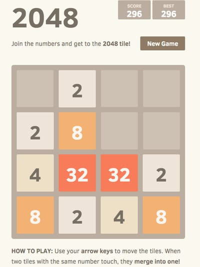

# CSE 230 Final Project - 2048+

## Team Members
- Yash Garde
- Shravan Konduru

## Proposal
We are planning to build a working version of the popular game 2048 as TUI using the Haskell `brick` library with some additional features.

The game is played on a 4x4 game board where the goal is to get the highest score possible. The players score is determined by the largest numbered tile that is present on the board at any time. To increase their score, the player must slide the numbered tiles (using the arrow-keys or WASD) to allow tiles with the same number to merge together. 

Each tile value is a power of 2 starting at 2 and can go as high as 2<sup>17</sup> and a new low values tile is added to the board with each move that is made. 

Additionally, players are given a set number of bombs during the game that will allow them to clear the board of a specific number that is taking up a lot of tiles on their board.

The game ends when the players board fills up and there are no valid moves for the player to make.



## Features
### Game Board
- An interactive 4x4 game board to play the game on that has displays for the players' current score and an ability to start a new game as necessary.
- Bombs to allow players to clear specific numbers from the board.
- A running score tracker for the current game score.


### Gameplay Mechanics
- The ability for the TUI application to read arrow key or WASD input and perform the required actions of merging or moving game tiles on the board as necessary.
- Logic that determines when a game is over if there is no space to place a new number tile after a move is made.
- Bomb logic to ensure that a bomb does not completely clear out the board and leaves it empty.

## Implementation Details

Our project was divided equally between the group members. One of us worked on the UI portion of the project using `brick` while the other was responsible for the game logic and gameplay functionality.

We divided the game's source code into separate modules for readability:

### Game.hs

This file contains all the code relating to the `brick` library. This includes:
- The definition of the Game's state: This include the board, the current screen the game is on, the current score, number of bombs etc.
- Drawing the start splash screen, game board and bomb use UI's that are a part of the game
- Event handling functions to execute the relevant code based on the input provided by the user.

### GameLogic.hs

This file contains all the code/functions relating to updating the Game's state based on the actions performed by the user. This includes:

- Functions to perform the merging of the tiles based on the direction input from the player
- Functions to check whether the game is over based on the current state of the board
- Functions to add random tiles to the board after each move.


The game will be built and run using `cabal`. More specifically, the command to build and run the game and all its dependencies is simply:
```
cabal run
```
